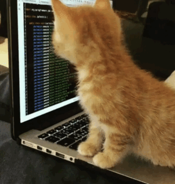

**Hi 👋, I'm 李浩正(Haozheng Li), a font-end developer. Love typescript, open source, and cat.**

Maintainer of the best typescript utils library [type-fest](https://github.com/sindresorhus/type-fest)
 
 

**My contributions**
-  | 
-  | 
-  | 
-  | 

 
 

